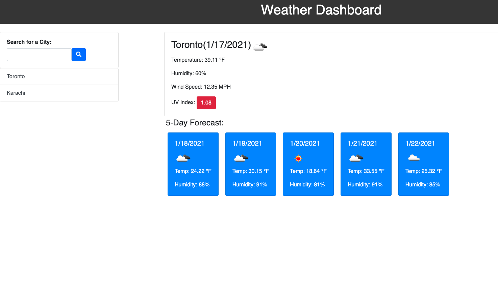

# Weather Dashboard

In this  project we are making a weather dashboard app with search functionality to find current weather conditions and future forecasted weather for multiple cities. This app uses open weather API to collect data for the cities, AJAX to connect into the API to collect the data in JSON format, it updates HTML and CSS powered by jQuery, and display shows a search history which the user can click to get past cities searched through local storage.

## Technologies
Technologies used for this project: 
* Bootstrap 4
* CSS
* Font Awesome
* HTML:5
* JavaScript
* jQuery
* Moment.js
* Open Weather API

## Screenshot

## Deployed link

## Github repo

